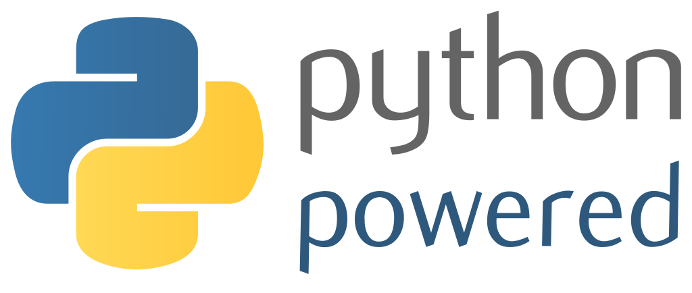


{{ title }}
{{ level }}

:title: {{ cookiecutter.project_name }}
:author: {{ cookiecutter.full_name }} <{{ cookiecutter.email }}>
:description: Copyright (c) {{ cookiecutter.year }}
:keywords: slides, impress.js
:auto-console: false
:skip-help: true
:css: css/default.css

----

:class: bullet-hand

{{ section(cookiecutter.project_name) }}

**{{ cookiecutter.full_name }} <{{ cookiecutter.email }}>**

Agenda
------

- What is `Hovercraft!`_?
- Why use `Hovercraft!`_?
- Show example `Hovercraft!`_ slides
- Present built-in styling options

----

:class: bullet-checkmark

What is Hovercraft?
===================

- Write your slides in *re*\ Structured\ *Text*
- Get a HTML5 / CSS3 presentation created from markup
- Prezi-style effects by using ``impress.js`` (including 3D effects)

.. break

- Convert to PDF to get a single-file document
- Easy to create using a template for new presentation projects
- You need Python3, a modern browser, and Linux / Mac OSX
- Not so Windows-friendly, but might work

  - some amount of manual setup
  - less convenience (e.g. no live reload watchdog)

----

:class: bullet-checkmark

Why Use Hovercraft?
===================

Disclaimer: YMMV

- HTML slides work everywhere, re-use CSS know-how
- But write in text markup (*re*\ Structured\ *Text*)
- Text is way more malleable than typical presentation software slides

  - Refactor your slides as you do with code
  - Text is SCM-friendly, get a proper change history
  - Easy to update embedded code snippets (even automatically)
  - Re-purpose your slides easily (blog posts, docs, …)

- Embedded presenter console (notes + timer + slide previews)
- Live-reload preview during authoring

----

:class: bullet-star

Bullet Styles
=============

- Bullet points cause *PowerPoint Poisoning*
- … but we use them anyway

.. break

- Styling top-level bullets

  - use ``:class: bullet-STYLE`` on the slide
  - ``bullet-checkmark``, ``bullet-arrow``, ``bullet-hand``, or ``bullet-star``

.. break

- To add spacing between bullets, add a *re*\ Structured\ *Text* comment:

    ::

        .. break

----

:class: centered huge bold red white-outline

| Text Style: centered huge bold red white-outline

| Use them in combination with background images

----

Text Styles
===========

- Emphasis: ``bold``
- Size: ``big``, ``bigger``, ``large``, ``huge``
- Color: ``red``, ``green``, ``blue``, ``black``, ``white``
- Outline: ``black-outline``, ``grey-outline``, ``white-outline``

----

Centered Images
===============

- Leave out the title for image-only slides
- Add ``:class: centered`` for centering
- Add ``:class: background`` to put it below other content

----

Floating Images
===============

- Eye-candy can sweeten bullet points
- Use ``:class: float-right`` on an image
- The image floats to the right of any content following it

----

Code Blocks
===========

.. code-block:: python
    :class: small

    @task(help={
        'browse': "Open slides in a new browser tab",
    })
    def html(ctx, browse=False):
        """Build HTML tree."""
        index_file = '_html/index.html'
        ctx.run("hovercraft -t simple --skip-notes index.rst {}"
                .format(os.path.dirname(index_file)))

        # Open in browser?
        if browse:
            webbrowser.open_new_tab(index_file)

----

:class: bullet-checkmark compact-items column-2

\>\>\> import this  # 2-column layout
=====================================

**The Zen of Python** (`PEP-20`_)

* Beautiful is better than ugly.
* Explicit is better than implicit.
* Simple is better than complex.
* Complex is better than complicated.
* Flat is better than nested.
* Sparse is better than dense.
* Readability counts.
* Special cases aren't special enough to break the rules.
* Although practicality beats purity.
* Errors should never pass silently.
* Unless explicitly silenced.
* Now is better than never.
* Although never is often better than *right* now.

.. break

* In the face of ambiguity, refuse the temptation to guess.
* There should be one – and preferably only one – obvious way to do it.
* Although that way may not be obvious at first unless you're Dutch.
* If the implementation is hard to explain, it's a bad idea.
* If the implementation is easy to explain, it may be a good idea.
* Namespaces are one honking great idea – let's do more of those!

.. _`PEP-20`: https://www.python.org/dev/peps/pep-0020/

----

:class: bullet-arrow

Credits
=======

- Powered by `Hovercraft!`_
- Powered by `Cookiecutter`_

.. break

- Hovercraft! logo – https://github.com/regebro/hovercraft/
- Python logo – https://www.python.org/community/logos/

*[Licensing conditions of the original projects apply]*

.. _`Hovercraft!`: http://hovercraft.readthedocs.org/
.. _`Cookiecutter`: https://github.com/audreyr/cookiecutter
